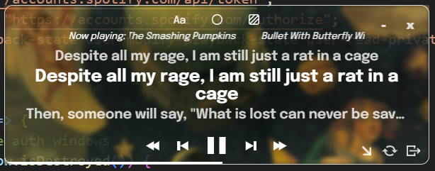

### ⋆ what ⋆
little widget that displays synced (hopefully) lyrics (hopefully) of the song you're
currently streaming with your spotify account

no testing (yet?) because i am the only user

### ⋆ features ⋆
- playback control for premium user (me)
- seek to position by fast-forward or rewind by 5s buttons, or by seeking on the progress bar
- various font, theme, and background opacity options
- it's cute :3
- window always stay on top
- makes me feel good

### ⋆ demo ⋆
